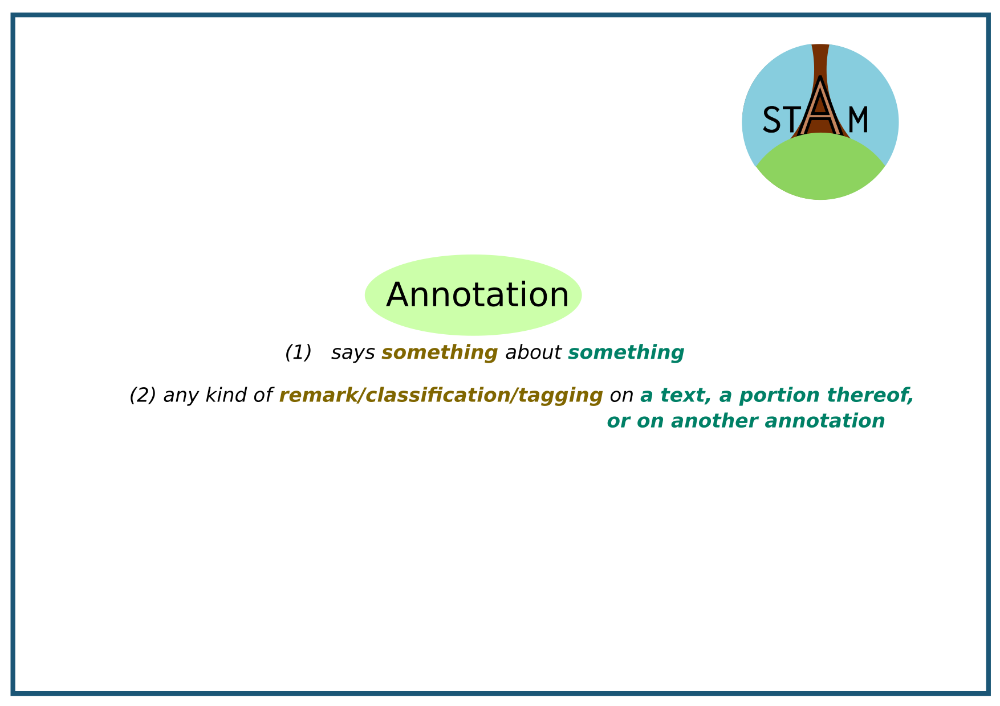
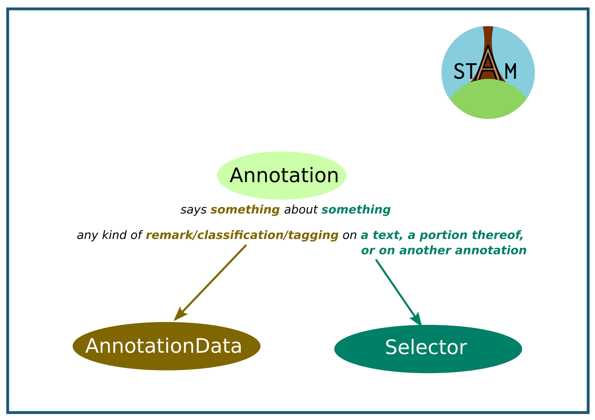
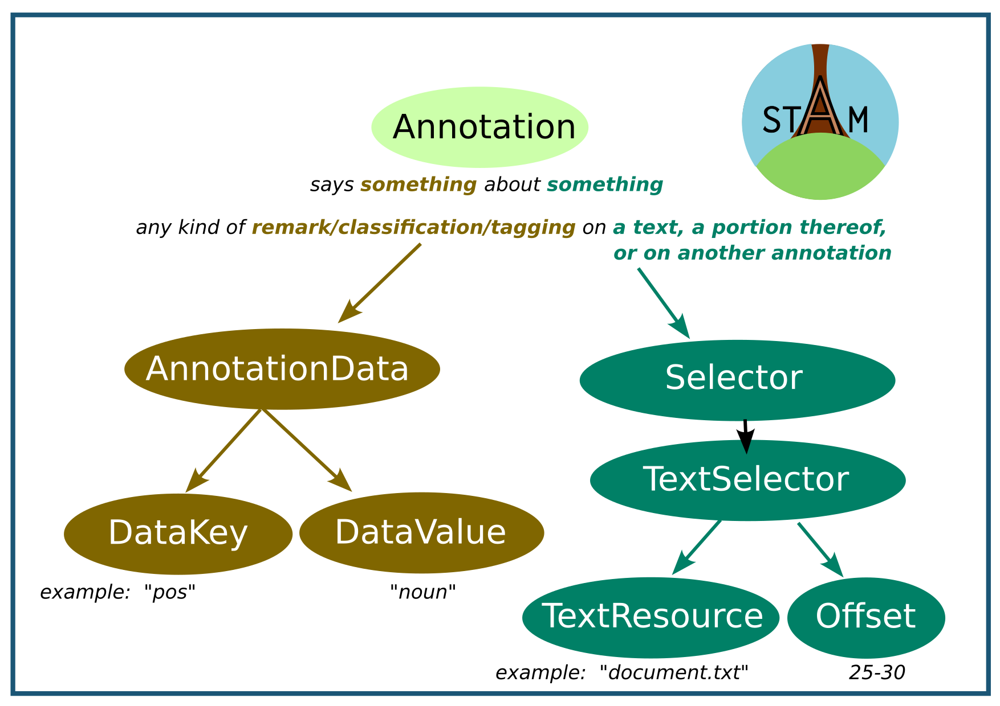
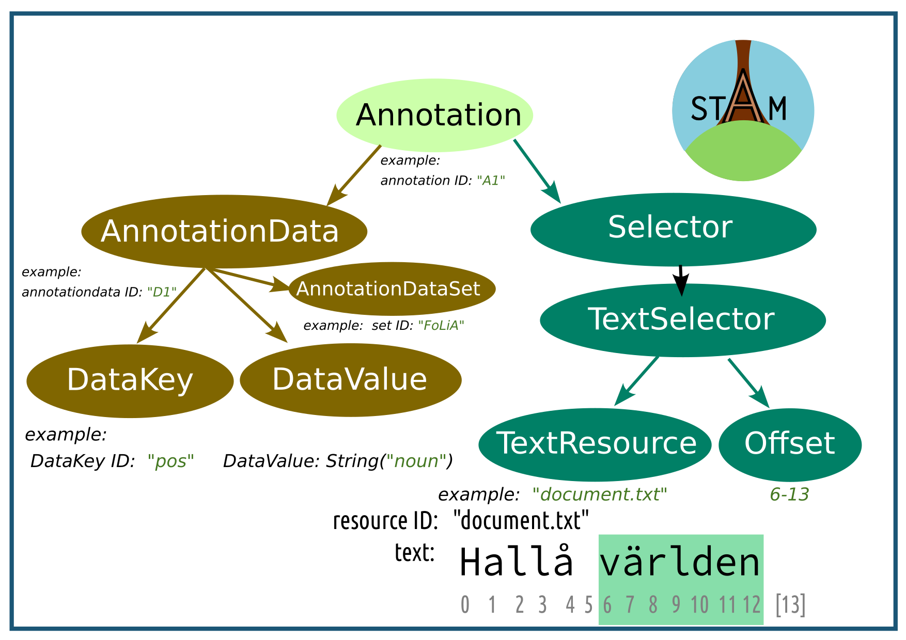
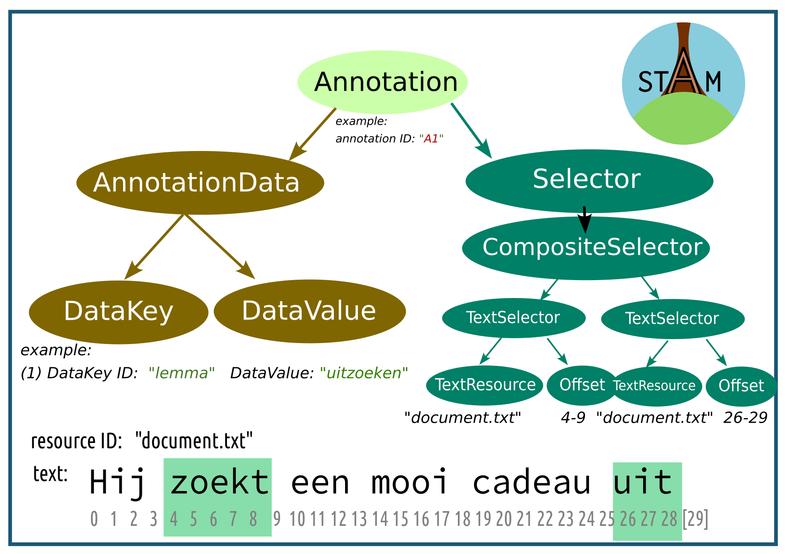
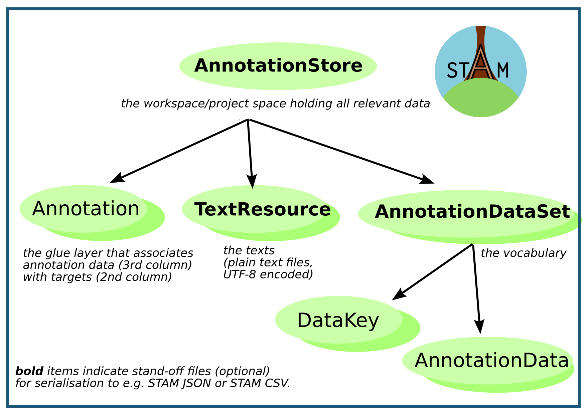

---
title: "STAM: Stand-off Text Annotation Model"
author: Maarten van Gompel
institute: KNAW Humanities Cluster
fontsize: 11pt
urlcolor: blue
titlegraphic: logo.png
--- 

## Introduction (1/4)

**What is STAM?**

1. A **data model** for **stand-off annotation** on **text**
2. A set of tools and software libraries for working with the data model.

## Introduction (2/4)

**What is STAM?**

1. A **data model** for **stand-off annotation** on **text**
    * aims to be **simple and minimal**, additional functionality formulated as **extensions** 
    * does not prescribe any **vocabulary** *(separation from semantics)*
    * no **dependencies** on other models
    * documented in a precise technical **specification** *(separation from implementation)*
    * not tied to any single **serialisation format**. *(separation from syntax)*

## Introduction (3/4)

2. A set of low-level tools and software libraries for working with the data model.
    * focus on **performance**: efficient usage of computing resources (memory, cpu)
    * focus on **reusability**: implement once, and re-use, core logic needed for annotations on text
    * **standalone**: runs on a wide variety of systems and independent of any wider service infrastructure: it should not depend on any software services.
    * **accessible**: clean APIs/CLIs and thoroughly documented

**Reference implementation**:

* `stam-rust`: a high-performant library that compiles to machine code (written in Rust, reference implementation)
* `stam-python`: a Python-binding
* `stam-tools`: Command Line tools for working with STAM

## Introduction (4/4)

STAM should provide a **solid generic foundation** for stand-off text annotation upon which other initiatives can build.

## Model

--------

--------

--------

--------

--------

--------

--------

--------

## Motivation

**Q:** Why a new model? How does this relate to W3C Web Annotations? FoLiA? TEI? LAF? etc?

* **W3C Web Annotations:**:
    * STAM has a more limited scope focussing on text only.
    * STAM is more lightweight: it does not build on RDF (but does offer a path towards RDF)
    * Web Annotations (Open Annotations) defines more vocabulary
* **FoLiA/TEI**:
    * They are strongly coupled to a serialisation format (XML), not stand-off 
    * These define a rich and specific vocabulary, STAM does not.
* **LAF**:
   * Too academic, limited and dated tooling

STAM is *NOT* a substitute for any of these, it is merely a foundational model in which more specific ones can be expressed.

## Interoperability

STAM design goals regarding interoperability:

* offer an easy transformation path *to* such more formalised models  (RDF/W3C Web Annotations)
* express existing annotation models (FoLiA, TEI, TextFabric). 
* act as pivot model to translate between vocabularies/formats.
* import custom annotation data from e.g. TSV/CSV in a flexible way.
* implementations may serve as an underlying engine for various applications dealing with annotation

## Functionality

* **Search**
    * find annotations based on relations like overlap, embedding, adjacency etc
    * find annotations based on the content of the annotation (AnnotationData)
    * find annotations based on text (incl regular expressions)
    * *(a STAM library computes various (reverse) indices)*
* **Annotation**
    * Add annotations; tag search results as new annotations
* **Data transformation**
    * compute offset information, update changed offsets after changing text
    * map vocabularies
    * *import* from simple TSV/CSV/JSON/CONLL files
    * *import* XML like FoLiA or TEI 
    * *export* to W3C Web Annotations

## Use-cases (1/2)

* As a researcher, You want a simple model to express annotation on text
    * you want complete freedom to use whatever vocabulary/annotation paradigm you see fit; either existing vocabularies or newly designed ones.
     * you want to import annotations from simple formats like CSV/TSV/CONLL
* As a researcher, you want to move from a simpler annotation model to a more formal model like web annotations -  STAM acts as a pivot model
* As a researcher/data scientist - You want to do low-level search on text and annotations without requiring complex infrastructure.
    * you want to find annotations based on relations like overlap, embedding, adjacency etc
    * you want to find annotations based on the content of the annotation
    * you want to find annotations based on text
    * you want to find/convert/compute offset information

## Use-cases (2/2)

* As a researcher/data scientist, you want to do basic low-level manipulation on text and annotations without requiring complex infrastructure
* As a researcher/data scientist, you want to quickly ingest annotation data from simple JSON, CSV, TSV formats.
* As a developer, you want a programming library that you can use to build an application handling stand-off annotation on text.
* As a development team, you don't want to implement similar base logic for annotations over an over again in different applications.
* As CLARIAH WP3, we want to facilitate conversion paths for CLARIAH formats like FoLiA XML and ubiquitous 3rd party formats like TEI, so they can be more comfortably used with other tools in the infrastructure that converge more towards stand-off annotation and linked open data.

## Limitations

* Current implementations are memory-based, i.e. scalability is limited to what fits in computer memory.

## Deliverables

**Specification** - <https://github.com/annotation/stam>

**Implementation:**

* *stam-rust*: Programming library for STAM for Rust - <https://github.com/annotation/stam-rust>
* *stam-python*: Python binding to the Rust library. - <https://github.com/annotation/stam-python>
* *stam-tools*:  Collection of command-line tools for working with STAM - <https://github.com/annotation/stam-tools>

**Documentation:**

* stam-rust API reference - <https://docs.rs/stam>
* stam-python API reference - <https://stam-python.readthedocs.io>
* STAM Tutorial: Standoff Text Annotation for Pythonistas - An extensive tutorial showing how to work with this Python library - <https://github.com/annotation/stam-python/blob/master/tutorial.ipynb>

## Acknowledgements

STAM is funded by CLARIAH-PLUS in the scope of the FAIR Annotation track of the Shared Development Roadmap, and 
CLARIAH WP3's Standoff Text Annotation task.
